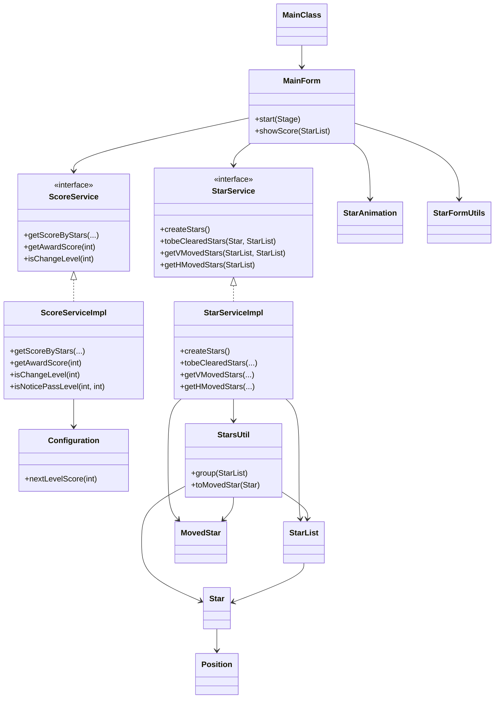

# 3. 详细设计和实现

## 3.1 系统类图


MainForm 通过 Spring 上下文获取 `StarService` 与 `ScoreService` 的实现，负责协调消除流程和积分动画；`StarServiceImpl` 则负责生成棋盘、搜索同色块以及在消除后给出纵/横向移动计划；`ScoreServiceImpl` 搭配 `Configuration` 读取通关参数并实现计分与关卡判定；`StarsUtil` 提供坐标排序、分组与实体转换等支持逻辑，上述关系在类图中统一展示，便于理解各模块之间的依赖与协作。【F:PRJ_BU2_JAVA_015/src/cn/campsg/practical/bubble/MainForm.java†L207-L320】【F:PRJ_BU2_JAVA_015/src/cn/campsg/practical/bubble/service/StarService.java†L1-L73】【F:PRJ_BU2_JAVA_015/src/cn/campsg/practical/bubble/service/StarServiceImpl.java†L38-L200】【F:PRJ_BU2_JAVA_015/src/cn/campsg/practical/bubble/service/ScoreService.java†L1-L88】【F:PRJ_BU2_JAVA_015/src/cn/campsg/practical/bubble/service/ScoreServiceImpl.java†L27-L160】【F:PRJ_BU2_JAVA_015/src/cn/campsg/practical/bubble/service/Configuration.java†L10-L49】【F:PRJ_BU2_JAVA_015/src/cn/campsg/practical/bubble/util/StarsUtil.java†L27-L158】

## 3.2 场景：泡泡糖体验（PRJ-BU2-JAVA-001）
### 设计说明
初始体验场景由 `StarServiceImpl#createBubbleMatrix` 构建 10×10 的随机棋盘，随后 `MainForm` 在启动时加载 FXML 布局并将 Label 元件与棋盘数据绑定，为后续交互打下基础。【F:PRJ_BU2_JAVA_001/src/cn/campsg/practical/bubble/service/StarServiceImpl.java†L38-L58】【F:PRJ_BU2_JAVA_001/src/cn/campsg/practical/bubble/MainForm.java†L78-L165】

### 关键代码
```java
public StarList createBubbleMatrix() {
    StarList stars = new StarList();
    for (int row = 0; row < StarService.MAX_ROW_SIZE; row++) {
        for (int col = 0; col < StarService.MAX_COLUMN_SIZE; col++) {
            Star star = new Star();
            star.setPosition(new Position(row, col));
            int typeIndex = (int) (Math.random() * StarService.STAR_TYPES);
            star.setType(StarType.valueOf(typeIndex));
            stars.add(star);
        }
    }
    return stars;
}
```
以上方法体现了基础棋盘的随机生成逻辑，是体验关卡的核心准备步骤。【F:PRJ_BU2_JAVA_001/src/cn/campsg/practical/bubble/service/StarServiceImpl.java†L38-L58】

## 3.3 场景：显示泡泡糖（PRJ-BU2-JAVA-002）
### 设计说明
该场景强调把业务对象渲染到界面：`MainForm#initGameStars` 负责查找根节点、调用 `StarService` 获得棋盘并逐个生成 Label 控件设置坐标、样式与标识，完成静态展示。【F:PRJ_BU2_JAVA_002/src/cn/campsg/practical/bubble/MainForm.java†L65-L133】

### 关键代码
```java
StarService starService = new StarServiceImpl();
mCurretStars = starService.createStars();
for (int i = 0; i < mCurretStars.size(); i++) {
    Star star = mCurretStars.get(i);
    Label starFrame = new Label();
    starFrame.setId("s" + row + col);
    starFrame.setLayoutX(col * 48);
    starFrame.getStyleClass().add("blue_star");
    mStarForm.getChildren().add(starFrame);
}
```
循环中根据坐标设置布局与 CSS 样式，体现了数据到视图的绑定实现。【F:PRJ_BU2_JAVA_002/src/cn/campsg/practical/bubble/MainForm.java†L73-L133】

## 3.4 场景：随机显示泡泡糖（PRJ-BU2-JAVA-003）
### 设计说明
在显示基础上进一步强调随机性，通过 `createStars` 调用 `Math.random()` 填充不同颜色，保证界面初始状态更加真实。【F:PRJ_BU2_JAVA_003/src/cn/campsg/practical/bubble/service/StarServiceImpl.java†L31-L40】

### 关键代码
```java
for (int i = 0; i < StarService.MAX_ROW_SIZE; i++) {
    for (int j = 0; j < StarService.MAX_COLUMN_SIZE; j++) {
        int random = (int) (Math.random() * 5);
        stars.add(new Star(new Position(i, j), StarType.valueOf(random)));
    }
}
```
双重循环与随机类型选择确保棋盘颜色分布不可预测，贴合场景需求。【F:PRJ_BU2_JAVA_003/src/cn/campsg/practical/bubble/service/StarServiceImpl.java†L31-L36】

## 3.5 场景：获得待消除的泡泡糖（PRJ-BU2-JAVA-004）
### 设计说明
本阶段实现递归搜索同色连通块：`StarsUtil.clone` 复制节点，`StarServiceImpl#lookupByPath` 分别从四个方向扩展并收集结果，`tobeClearedStars` 负责触发搜索与去除单点选择。【F:PRJ_BU2_JAVA_004/src/cn/campsg/practical/bubble/util/StarsUtil.java†L31-L48】【F:PRJ_BU2_JAVA_004/src/cn/campsg/practical/bubble/service/StarServiceImpl.java†L54-L148】

### 关键代码
```java
if (baseColumn > 0) {
    Star left = sList.lookup(baseRow, baseColumn - 1);
    if (left != null && !clearStars.existed(left) && left.getType() == base.getType()) {
        clearStars.add(StarsUtil.clone(left));
        lookupByPath(left, sList, clearStars);
    }
}
```
方向遍历段通过判空、去重与类型比对确保递归收敛到同色块，支撑“获得待消除目标”的功能实现。【F:PRJ_BU2_JAVA_004/src/cn/campsg/practical/bubble/service/StarServiceImpl.java†L54-L70】

## 3.6 场景：封装待移动的泡泡糖（PRJ-BU2-JAVA-005）
### 设计说明
该阶段补全实体 `Position`、`Star` 的 `toString` 便于调试，并在 `StarServiceImpl#getYMovedStars` 中构建 `MovedStar` 列表描述下落路径，配合 `StarsUtil.toMovedStar` 完成对象转换。【F:PRJ_BU2_JAVA_005/src/cn/campsg/practical/bubble/entity/Position.java†L42-L46】【F:PRJ_BU2_JAVA_005/src/cn/campsg/practical/bubble/entity/Star.java†L81-L85】【F:PRJ_BU2_JAVA_005/src/cn/campsg/practical/bubble/service/StarServiceImpl.java†L167-L179】

### 关键代码
```java
for (int i = 6; i >= 0; i--) {
    Star star = currentStarList.lookup(i, 0);
    MovedStar mStar = new MovedStar(star.getPosition(), star.getType(), null);
    mStar.setMovedPosition(new Position(i + 2, 0));
    moveStars.add(mStar);
}
```
通过组合原始坐标与目标位置描述纵向动画，便于后续控制层驱动 Label 下落。【F:PRJ_BU2_JAVA_005/src/cn/campsg/practical/bubble/service/StarServiceImpl.java†L167-L178】

## 3.7 场景：体验接口解耦特性（PRJ-BU2-JAVA-006）
### 设计说明
`MainForm` 保持对 `StarService` 接口的依赖，可在运行时替换为 `StarServiceTester` 等不同实现；后者提供固定数据方便验证显示逻辑，从而展现接口解耦优势。【F:PRJ_BU2_JAVA_006/src/cn/campsg/practical/bubble/MainForm.java†L75-L139】【F:PRJ_BU2_JAVA_006/src/cn/campsg/practical/bubble/service/StarServiceTester.java†L8-L57】

### 关键代码
```java
StarService starService = new StarServiceImpl();
// StarService starService = getStarService();
mCurretStars = starService.createStars();
```
保留接口类型并提供测试实现切换点，显示了依赖抽象的设计意图。【F:PRJ_BU2_JAVA_006/src/cn/campsg/practical/bubble/MainForm.java†L80-L87】

## 3.8 场景：体验接口隔离性（PRJ-BU2-JAVA-007）
### 设计说明
本场景实现事件处理器内部只依赖 `StarService` 能力：点击泡泡会转换坐标、查询待消除集合并清理对应的 Label，体现了通过接口隔离 UI 与业务的实践。【F:PRJ_BU2_JAVA_007/src/cn/campsg/practical/bubble/MainForm.java†L128-L163】

### 关键代码
```java
class StartEventHandler implements EventHandler {
    public void handle(Event event) {
        Label starFrame = (Label) event.getTarget();
        Star base = StarFormUtils.convert(starFrame);
        StarList starList = starService.tobeClearedStars(base, mCurretStars);
        for (int i = 0; i < starList.size(); i++) {
            Label frame = StarFormUtils.findFrame(starList.get(i), mStarForm);
            StarAnimation.clearStarLable(mStarForm, frame);
        }
    }
}
```
事件中未直接操作数据源，而是通过接口返回的集合驱动界面更新，突出接口隔离的效果。【F:PRJ_BU2_JAVA_007/src/cn/campsg/practical/bubble/MainForm.java†L128-L159】

## 3.9 场景：移动垂直方向的泡泡糖（一）（PRJ-BU2-JAVA-010）
### 设计说明
实现纵向下落所需的排序与交换工具，并在 `getYMovedStars` 中计算空位与目标位置，生成 `MovedStar` 队列交由动画层处理。【F:PRJ_BU2_JAVA_010/src/cn/campsg/practical/bubble/util/StarsUtil.java†L35-L86】【F:PRJ_BU2_JAVA_010/src/cn/campsg/practical/bubble/service/StarServiceImpl.java†L82-L115】

### 关键代码
```java
StarsUtil.sort(clearStars);
int bottomRow = clearStars.get(clearStars.size() - 1).getPosition().getRow();
for (int i = bottomRow; i >= 0; i--) {
    Star star = currentStarList.lookup(i, 0);
    if (clearStars.existed(star)) {
        rowMove++;
    } else {
        MovedStar movedStar = new MovedStar(
            star.getPosition(), star.getType(),
            new Position(star.getPosition().getRow() + rowMove, star.getPosition().getColumn()));
        starsWaitToMove.add(movedStar);
    }
}
```
依据空位累积量 `rowMove` 计算每个方块的最终行号，实现垂直方向的同步下落规划。【F:PRJ_BU2_JAVA_010/src/cn/campsg/practical/bubble/service/StarServiceImpl.java†L82-L105】

## 3.10 场景：移动垂直方向的泡泡糖（二）（PRJ-BU2-JAVA-011）
### 设计说明
为了支持更复杂的列处理，`StarList` 新增按坐标查找、判重等方法，便于服务层快速定位剩余泡泡并判断是否已经加入集合。【F:PRJ_BU2_JAVA_011/src/cn/campsg/practical/bubble/entity/StarList.java†L40-L125】

### 关键代码
```java
public Star lookup(int row, int column) {
    for (int i = 0; i < this.size(); i++) {
        Star star = this.get(i);
        if (star != null && star.getPosition().getRow() == row
                && star.getPosition().getColumn() == column) {
            return star;
        }
    }
    return null;
}
```
这些集合操作封装使服务层无需遍历原始二维数组即可获取元素，提升了垂直下落实现的可读性。【F:PRJ_BU2_JAVA_011/src/cn/campsg/practical/bubble/entity/StarList.java†L40-L49】

## 3.11 场景：移动垂直方向的泡泡糖（三）（PRJ-BU2-JAVA-012）
### 设计说明
在前两阶段的基础上，利用 `StarsUtil.sort` 与 `group` 按列聚合被消除的节点，`getYMovedStars` 按列迭代计算每个泡泡的最终位置，实现多列同时下落。【F:PRJ_BU2_JAVA_012/src/cn/campsg/practical/bubble/util/StarsUtil.java†L42-L131】【F:PRJ_BU2_JAVA_012/src/cn/campsg/practical/bubble/service/StarServiceImpl.java†L279-L316】

### 关键代码
```java
Iterator<Integer> iterator = StarsUtil.group(clearStars).keySet().iterator();
while (iterator.hasNext()) {
    int col = iterator.next();
    int rowMove = 0;
    int bottomRow = clearStars.get(clearStars.size() - 1).getPosition().getRow();
    for (int i = bottomRow; i >= 0; i--) {
        Star star = currentStarList.lookup(i, col);
        if (clearStars.existed(star)) {
            rowMove++;
        } else {
            MovedStar movedStar = new MovedStar(
                star.getPosition(), star.getType(),
                new Position(star.getPosition().getRow() + rowMove, star.getPosition().getColumn()));
            starsWaitToMove.add(movedStar);
        }
    }
}
```
通过列分组与逐列遍历兼顾多个空洞，实现垂直移动的完整版本。【F:PRJ_BU2_JAVA_012/src/cn/campsg/practical/bubble/service/StarServiceImpl.java†L279-L307】

## 3.12 场景：移动水平方向的泡泡糖（PRJ-BU2-JAVA-013）
### 设计说明
先用 `getNullColumns` 统计右侧空列，再在 `getXMovedStars` 中累计水平偏移量，为非空列生成 `MovedStar` 目标坐标，实现列压缩逻辑。【F:PRJ_BU2_JAVA_013/src/cn/campsg/practical/bubble/service/StarServiceImpl.java†L350-L410】

### 关键代码
```java
ArrayList<Integer> nullColumns = getNullColumns(currentStarList);
int xMove = 0;
for (int col = nullColumns.get(0); col < MAX_COLUMN_SIZE; col++) {
    if (nullColumns.contains(col)) {
        xMove++;
    } else {
        for (int row = 9; row >= 0; row--) {
            Star star = currentStarList.lookup(row, col);
            if (star == null) break;
            MovedStar movedStar = new MovedStar(
                new Position(star.getPosition().getRow(), star.getPosition().getColumn()),
                star.getType(),
                new Position(star.getPosition().getRow(), star.getPosition().getColumn() - xMove));
            moveStars.add(movedStar);
        }
    }
}
```
根据空列数量动态计算列偏移，实现横向紧凑排列的业务目标。【F:PRJ_BU2_JAVA_013/src/cn/campsg/practical/bubble/service/StarServiceImpl.java†L381-L400】

## 3.13 场景：更新关卡通关分数（PRJ-BU2-JAVA-014）
### 设计说明
通过 `Configuration` 读取 `score.conf` 中的初始分数、步长和增量，`nextLevelScore` 按配置累计生成下一关的目标分值，为通关条件提供数据支持。【F:PRJ_BU2_JAVA_014/src/cn/campsg/practical/bubble/service/Configuration.java†L12-L49】

### 关键代码
```java
score.setLevelScore(Integer.parseInt(br.readLine()));
score.setStep(Integer.parseInt(br.readLine()));
score.setIncrement(Integer.parseInt(br.readLine()));
...
int sum = this.getScore().getLevelScore()
        + this.getScore().getStep()
        + (nextLevel - 1) / this.getScore().getLength() * this.getScore().getIncrement();
score.setLevelScore(sum);
```
读取配置文件后按照阶梯规则递增关卡目标，保证通关分数可配置且可持续增长。【F:PRJ_BU2_JAVA_014/src/cn/campsg/practical/bubble/service/Configuration.java†L18-L48】

## 3.14 场景：实现泡泡糖的积分规则（PRJ-BU2-JAVA-015）
### 设计说明
终局场景整合完整计分与关卡逻辑：`ScoreServiceImpl` 根据消除数量平方计分、按剩余数量奖励加分，并依据配置判定是否晋级；`MainForm` 中的事件处理器通过 `showScore` 播放动画、更新分数并触发奖励或下一关流程。【F:PRJ_BU2_JAVA_015/src/cn/campsg/practical/bubble/service/ScoreServiceImpl.java†L91-L159】【F:PRJ_BU2_JAVA_015/src/cn/campsg/practical/bubble/MainForm.java†L229-L353】

### 关键代码
```java
public int getScoreByStars(int stars) {
    return LOWER_SCORE * stars * stars;
}

public int getAwardScore(int leftStarNum) {
    if (leftStarNum > AWARD_LIMIT) {
        return 0;
    }
    return LOWER_AWARD_SCORE * (AWARD_LIMIT - leftStarNum)
            * (AWARD_LIMIT - leftStarNum);
}

public boolean isChangeLevel(int score) {
    int target = mConfiguration.getScore().getLevelScore();
    return score >= target;
}
```
平方计分、剩余奖励与关卡判断构成最终积分体系，主界面在消除事件后调用这些方法即可驱动完整的得分与通关体验。【F:PRJ_BU2_JAVA_015/src/cn/campsg/practical/bubble/service/ScoreServiceImpl.java†L91-L138】
